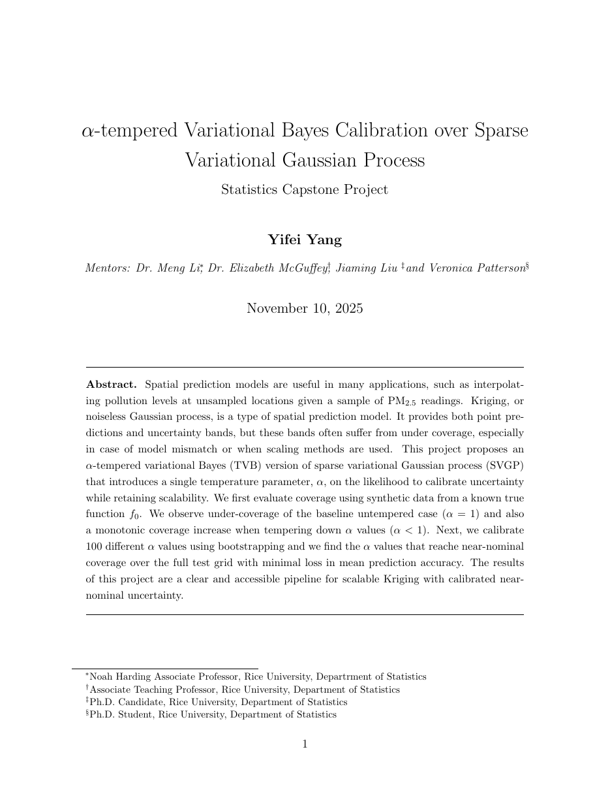
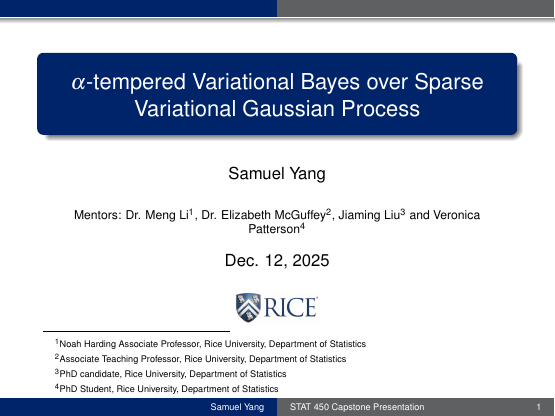
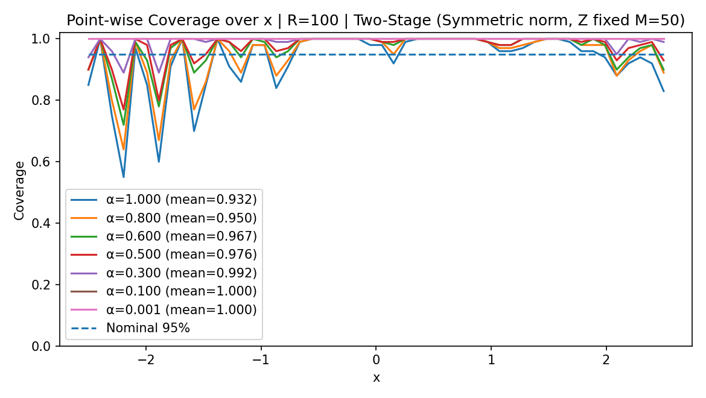
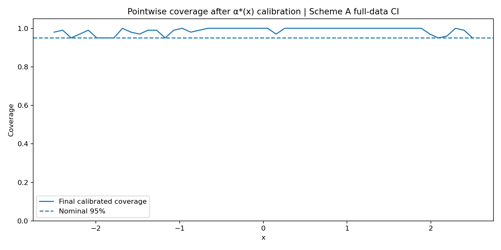
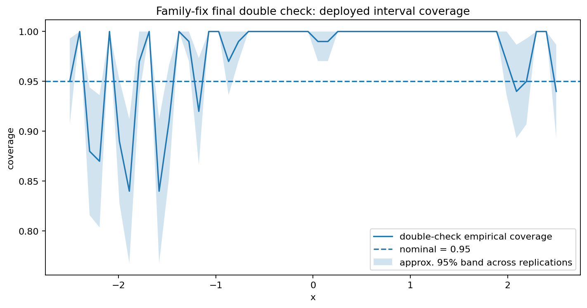

# Calibrating Sparse Variational Gaussian Processes with α-Tempered Variational Bayes

This repository contains the code, notebooks, simulation summaries, diagnostic figures, manuscript, and presentation for a research project on uncertainty calibration in sparse variational Gaussian processes (SVGPs).

The central problem is that a standard SVGP can provide an accurate posterior mean while its nominal 95% credible bands under-cover the true latent function. The project studies whether likelihood tempering can repair interval coverage without sacrificing the scalability of the sparse variational approximation.

## Paper and presentation

<p align="center">
  <a href="paper.pdf"></a>
  &nbsp;&nbsp;
  <a href="presentation_slides.pdf"></a>
</p>

<p align="center">
  <strong><a href="paper.pdf">Read the paper</a></strong>
  &nbsp;&nbsp;|&nbsp;&nbsp;
  <strong><a href="presentation_slides.pdf">View the presentation slides</a></strong>
</p>

## Research question and method

The experiments use the synthetic latent function

$$
f_0(x) = \sin(2\pi x) + 0.5\cos(3x), \qquad x \in [-2.5, 2.5].
$$

The main workflow is:

1. Fit a standard SVGP at `α = 1` (Stage 1).
2. Freeze the fitted mean and kernel hyperparameters.
3. Re-optimize only the variational covariance with likelihood weight `β = 1/α` (Stage 2).
4. Estimate pointwise coverage over an α-grid.
5. Select a location-dependent `α*(x)` using two-split/bootstrap calibration.
6. Refit on the full sample and double-check the deployed interval coverage on independent replications.

With `n` observations and `m` inducing points, the sparse approximation retains the usual approximate complexity `O(nm² + m³)` instead of the `O(n³)` cost of a full Gaussian process.

## Main findings

The manuscript's 100-replication experiment used `n = 500`, `m = 50`, a 50-point test grid, an RBF kernel, a fixed Gaussian-likelihood nugget of `3e-3`, FP64 arithmetic, and a 95% nominal interval.

| α | Mean coverage | Mean squared error | Mean negative ELBO |
|---:|---:|---:|---:|
| 1.000 | 0.9252 | 2.09e-4 | -1.70 |
| 0.800 | 0.9440 | 2.09e-4 | -1.64 |
| 0.600 | 0.9618 | 2.09e-4 | -1.55 |
| 0.500 | 0.9708 | 2.09e-4 | -1.47 |
| 0.300 | 0.9882 | 2.09e-4 | -1.18 |
| 0.100 | 0.9994 | 2.09e-4 | 0.21 |
| 0.001 | 1.0000 | 2.09e-4 | 154.0 |

Coverage increases monotonically as α decreases, while the fitted mean and its MSE remain essentially unchanged. The strongest under-coverage occurs near difficult boundary locations, so a single global α is unnecessarily conservative in much of the domain.



The 15-point calibration experiment selected `α*(x)` only where correction was needed. Its archived aggregate result has mean pointwise coverage `0.9872`, a minimum of `0.95`, and mean selected α `0.9107`.



Later family-consistent deployment diagnostics are more demanding. Across 100 full-deployment replications, the archived summary reports overall coverage `0.976`; pointwise coverage ranges from `0.84` to `1.00`. This shows both the benefit of tempering and the remaining instability at a small number of locations.



The `reproduction/` recalibration run provides an additional end-to-end check. Its 100-replication summary has mean pointwise deployed coverage `0.9404` (minimum `0.70`) even though the calibration-stage estimate averages `0.9958`. This gap is scientifically important: it motivates the later family-identity, cross-fit, transfer-gap, and LCB diagnostics in the repository. Results from different folders reflect successive experiment variants and should not be treated as identical configurations.

## Repository contents

| Path | Contents |
|---|---|
| [`paper.pdf`](paper.pdf) | Full manuscript and experiment description |
| [`presentation_slides.pdf`](presentation_slides.pdf) | Seminar presentation |
| [`project_files/svgpstep1/`](project_files/svgpstep1/) | Baseline SVGP and α-grid experiments |
| [`project_files/calibration/`](project_files/calibration/) | Initial bootstrap-calibration code and checks |
| [`project_files/two_split/`](project_files/two_split/) | Two-split pointwise calibration experiments |
| [`project_files/26 spring/with reference/`](project_files/26%20spring/with%20reference/) | Later 15/30-point, cross-fit, family-fix, and LCB experiments |
| [`project_files/26 spring/stage1/`](project_files/26%20spring/stage1/) | Additional Stage 1 diagnostics |
| [`project_files/reproduction/`](project_files/reproduction/) | Recalibration reproduction scripts and compact per-rep outputs |
| [`project_files/outputs/`](project_files/outputs/) | Baseline aggregate tables and figures |
| [`assets/`](assets/) | Selected figures displayed in this README |

Repository folder and file names have been standardized to English. The broader experiment structure is otherwise preserved so paths remain recognizable.

## Local setup: macOS, Windows, and VS Code

Python 3.10 or 3.11 is recommended. The original study records PyTorch 2.5.1 and GPyTorch 1.14.

First clone the repository:

```bash
git clone https://github.com/yangyifei877-web/SVGP_research_project.git
cd SVGP_research_project
```

### macOS or Linux (Terminal)

```bash
python3 -m venv .venv
source .venv/bin/activate
python -m pip install --upgrade pip
python -m pip install -r requirements.txt
```

### Windows (PowerShell)

```powershell
py -3.11 -m venv .venv
Set-ExecutionPolicy -Scope Process -ExecutionPolicy Bypass
.\.venv\Scripts\Activate.ps1
python -m pip install --upgrade pip
python -m pip install -r requirements.txt
```

If `py -3.11` is unavailable, install Python 3.11 from [python.org](https://www.python.org/downloads/windows/) and enable **Add Python to PATH** during installation.

### Windows (Command Prompt)

```bat
py -3.11 -m venv .venv
.venv\Scripts\activate.bat
python -m pip install --upgrade pip
python -m pip install -r requirements.txt
```

### VS Code

Open the repository with `code .`, then run **Python: Select Interpreter** from the Command Palette:

- macOS/Linux: select `.venv/bin/python`.
- Windows: select `.venv\Scripts\python.exe`.

For a notebook, click the kernel name in the upper-right corner and choose the same interpreter. If VS Code does not detect it, install the official Python and Jupyter extensions and reload the window.

PyTorch will run on CPU on both macOS and Windows. The full 100-replication/bootstrap experiments are computationally expensive; begin with one replication and a small bootstrap count.

### 1. Small α-grid / calibration run

```bash
mkdir -p runs/alpha-grid-smoke
python "project_files/26 spring/with reference/alpha_grid.py" \
  --rep-id 0 \
  --B 5 \
  --alphas 1.0,0.8,0.5 \
  --no-save-pseudo-truth \
  --out-dir runs/alpha-grid-smoke
```

Increase `--B` and expand the α-grid only after this small run succeeds.

Windows PowerShell equivalent:

```powershell
New-Item -ItemType Directory -Force runs/alpha-grid-smoke | Out-Null
python "project_files/26 spring/with reference/alpha_grid.py" `
  --rep-id 0 `
  --B 5 `
  --alphas 1.0,0.8,0.5 `
  --no-save-pseudo-truth `
  --out-dir runs/alpha-grid-smoke
```

### 2. Family-consistent calibration and deploy

```bash
mkdir -p runs/familyfix-rep0
python "project_files/26 spring/with reference/familyfix/svgp_twosplit_bootstrap_familyfix_calibbank.py" \
  --rep-id 0 \
  --B 10 \
  --alphas 1.0,0.8,0.6,0.4,0.2 \
  --selection-rule largest_meeting_target \
  --stage1-epochs 100 \
  --stage2-epochs 50 \
  --batch-size 500 \
  --out-dir runs/familyfix-rep0
```

For the original-scale experiment, use the script defaults or the parameters recorded in the manuscript and run replications independently.

Windows PowerShell equivalent:

```powershell
New-Item -ItemType Directory -Force runs/familyfix-rep0 | Out-Null
python "project_files/26 spring/with reference/familyfix/svgp_twosplit_bootstrap_familyfix_calibbank.py" `
  --rep-id 0 `
  --B 10 `
  --alphas 1.0,0.8,0.6,0.4,0.2 `
  --selection-rule largest_meeting_target `
  --stage1-epochs 100 `
  --stage2-epochs 50 `
  --batch-size 500 `
  --out-dir runs/familyfix-rep0
```

### 3. Recalibration / double-check reproduction

The script in `reproduction/` expects a calibration directory containing one subdirectory per replication, such as `rep_0/`, with exactly one `pointwise_coverage_rep*_A*_B*.csv` file inside.

```bash
mkdir -p runs/recalibration-doublecheck
python "project_files/reproduction/alpha_star_doublecheck_per_rep.py" \
  --rep-id 0 \
  --calib-dir /absolute/path/to/calibration/results \
  --out-dir runs/recalibration-doublecheck
```

Windows PowerShell equivalent:

```powershell
New-Item -ItemType Directory -Force runs/recalibration-doublecheck | Out-Null
python "project_files/reproduction/alpha_star_doublecheck_per_rep.py" `
  --rep-id 0 `
  --calib-dir "C:\absolute\path\to\calibration\results" `
  --out-dir runs/recalibration-doublecheck
```

For each test location, the script selects the largest α whose estimated coverage reaches 0.95 (minimal tempering); if no α reaches the target, it selects the α with the highest estimated coverage. It then reconstructs the same full dataset, refits Stage 1, refits Stage 2 for each unique selected α, and saves pointwise hit indicators.

## Reproducibility notes

- Random seeds are derived from a base seed plus the replication ID.
- The simulation is noiseless; likelihood noise is a fixed numerical nugget.
- Default scripts may contain Rice cluster paths such as `/scratch/$USER/...`; always pass `--out-dir` when running locally.
- Several notebooks are exploratory and assume that earlier-stage output files already exist.
- Aggregate CSV and PNG results are included so the main conclusions can be inspected without rerunning every simulation.

The original folder was approximately 2 GB. This GitHub snapshot includes all source code, notebooks, PDFs, JSON metadata, CSV results, and PNG diagnostics, plus the compact NumPy outputs under `reproduction/`. It excludes roughly 1.7 GB of `.npz` interval banks, roughly 215 MB of other `.npy` intermediate arrays, notebook checkpoints, duplicate ZIP archives, and macOS metadata. These are generated intermediates rather than the only copies of final reported results.

## Limitations

The current evidence is based mainly on a one-dimensional, noiseless synthetic problem with a fixed test grid and an RBF kernel. Remaining work includes higher-dimensional inputs, noisy observations, non-stationary or alternative kernels, more stable data-dependent α selection, and theoretical guarantees for the calibrated bands.

## Reference

If you use this repository, please cite the accompanying manuscript:

> Yifei Yang. *α-tempered Variational Bayes Calibration over Sparse Variational Gaussian Process*. STAT 450 Capstone Project.
